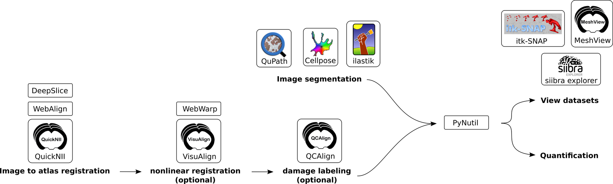

PyNutil
=======
A Python library for brain-wide quantification and spatial analysis of features
in serial section images from the brain.

.. grid:: 1 2 2 3
   :gutter: 3

   .. grid-item-card:: :fas:`book;sd-text-primary` User guide
      :link: getting_started
      :link-type: doc

      Installation, input formats and the core quantification workflow.

   .. grid-item-card:: :fas:`desktop;sd-text-primary` GUI
      :link: gui
      :link-type: doc

      Run the same atlas-based analyses through the desktop interface.

   .. grid-item-card:: :fas:`images;sd-text-primary` Gallery
      :link: demos
      :link-type: doc

      3D visualisation, heatmaps and worked Python examples.

Overview
----------
PyNutil connects registration, segmentation and atlas data so that features in
serial section images can be quantified across the whole brain. It takes outputs
from tools such as QuickNII, VisuAlign, BrainGlobe registration and common image
segmentation workflows, then produces atlas-based reports and spatial outputs.

PyNutil aims to replicate and expand the Quantifier feature of the Nutil
software (RRID: SCR_017183) while making the workflow available from Python and
from a desktop GUI.

Core workflows
--------------

.. grid:: 1 2 2 3
   :gutter: 3

   .. grid-item-card:: :fas:`shapes;sd-text-primary` Segmentations

      Count labelled objects or pixels in registered section images, then
      summarise them by atlas region.

   .. grid-item-card:: :fas:`chart-area;sd-text-primary` Intensity images

      Sample image intensity in atlas space for expression maps, tracer signal
      or other continuous measurements.

   .. grid-item-card:: :fas:`location-dot;sd-text-primary` Point coordinates

      Transform pre-extracted detections into atlas coordinates and quantify
      their regional distribution.

Outputs
-------

PyNutil writes CSV reports for regional quantification, MeshView-compatible
point clouds for spatial inspection, and NIfTI volumes for reconstructed 3D
heatmaps. The same analysis patterns can be scripted with the Python API or run
from the GUI.

.. toctree::
   :maxdepth: 2
   :caption: Contents:

   User guide <getting_started>
   gui
   Examples <demos>
   API reference <api_index>

Highlights
----------

* Use BrainGlobe atlases or custom atlas volumes in ``.nrrd`` format.
* Read registration data from QuickNII, VisuAlign, DeepSlice, or
  BrainGlobe registration outputs.
* Quantify binary segmentations or intensity images against atlas regions.
* Export point clouds for MeshView and interpolated NIfTI volumes for
  siibra explorer or ITK-SNAP.

.. warning::

   PyNutil is still under development and the API is subject to change.

For more background on the QUINT workflow, see
`QUINT workflow documentation <https://quint-workflow.readthedocs.io/en/latest/>`_.

Index & Search
--------------

* :ref:`genindex`
* :ref:`search`
